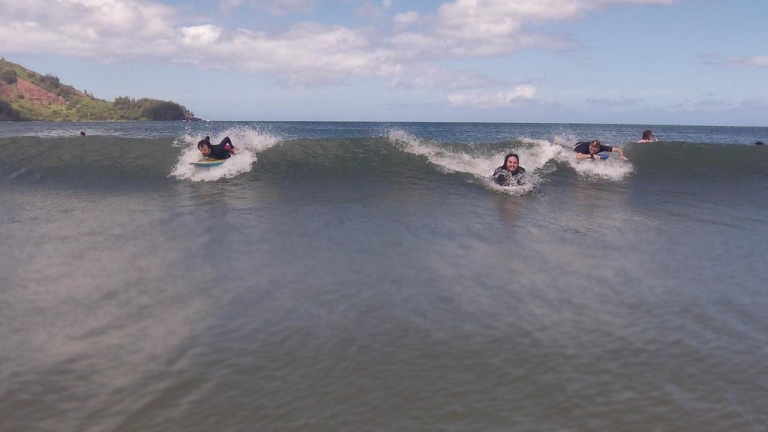
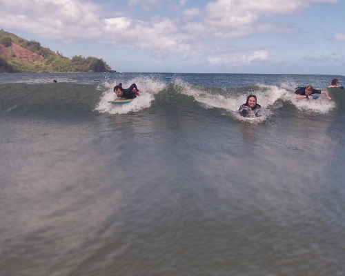
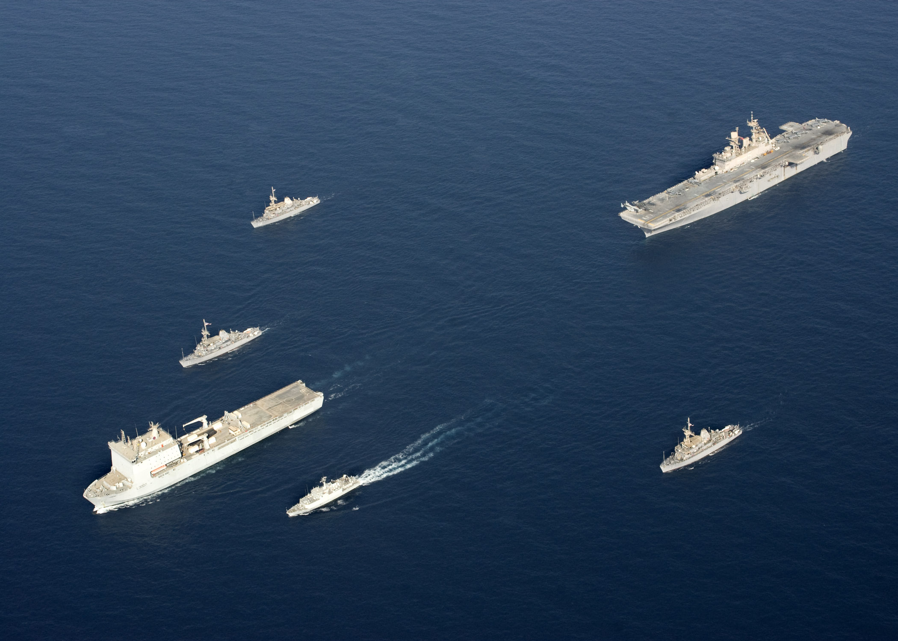
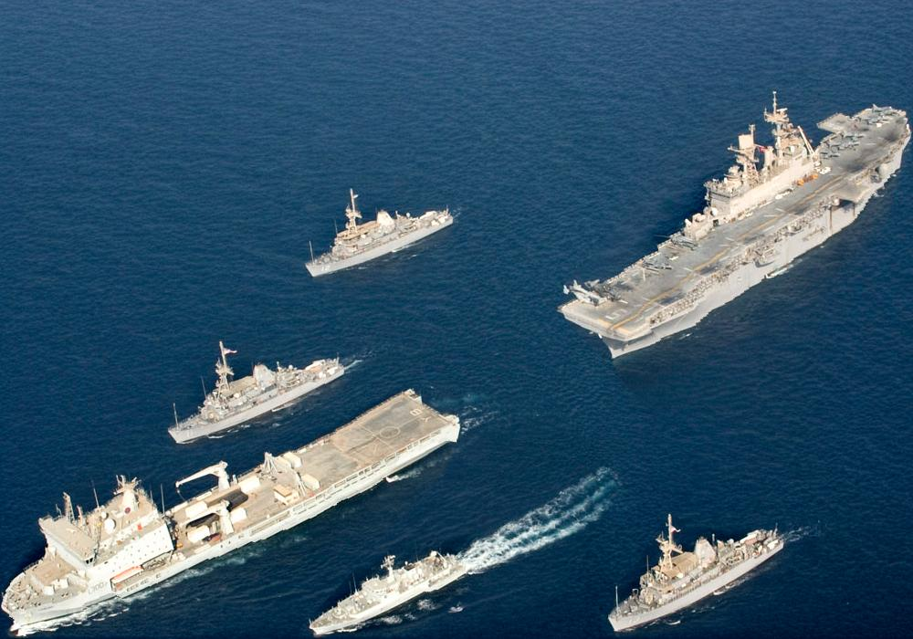

# Seam Carving

Command line based content-aware image resizing application.

## Introduction

Seam-carving is a content-aware image resizing technique where the image is reduced in size by one pixel of height (or width) at a time. Unlike standard content-agnostic resizing techniques (e.g. cropping and scaling), the most interesting features (aspect ratio, set of objects present, etc.) of the image are preserved.

## Motivation

I did this project as a programming assignment of Coursera online course, [Algorithms Part I][courselink1] and [Algorithms Part II][courselink2], created by Princeton University. An excellent discussion of seam carving can be found at the [assignment homepage][assignment].

A dynamic demonstration of seam carving is also available on [YouTube][youtubelink].

## Installation

**Dependencies**

[algs4.jar][lib]
Following programs are used from this library.

```
Picture.java
StdOut.java
Stopwatch.java
Stack.java
```

**Compile**

Put the [algs4.jar][lib] library in a folder named `lib`

```
javac -cp ".;./lib/algs4.jar" DeluxeAcyclicSP.java SeamCarver.java ResizeDemo.java
```

**Run**
```
java -cp ".;./lib/algs4.jar" ResizeDemo input.png newWidth newHeight
```

**Basic Usage**
```
java -cp ".;./lib/algs4.jar" ResizeDemo HJocean.png 500 400
```

**This is only for discussion and communication. Please don't use this for submission of assignments.**

## Examples

**Original**

  
[Source](http://coursera.cs.princeton.edu/algs4/assignments/seam.html)

**Resized**



**Original**


[Source](https://commons.wikimedia.org/wiki/File%3AUS_Navy_090905-N-3165S-631_The_Royal_Navy_fleet_auxiliary_ship_Lyme_Bay_(L_3007)_leads_a_formation_of_ships.jpg)

**Resized**


[courselink1]: https://www.coursera.org/learn/algorithms-part1
[courselink2]: https://www.coursera.org/learn/algorithms-part2
[assignment]: http://coursera.cs.princeton.edu/algs4/assignments/seam.html
[youtubelink]: https://www.youtube.com/watch?v=6NcIJXTlugc
[lib]: http://algs4.cs.princeton.edu/code/